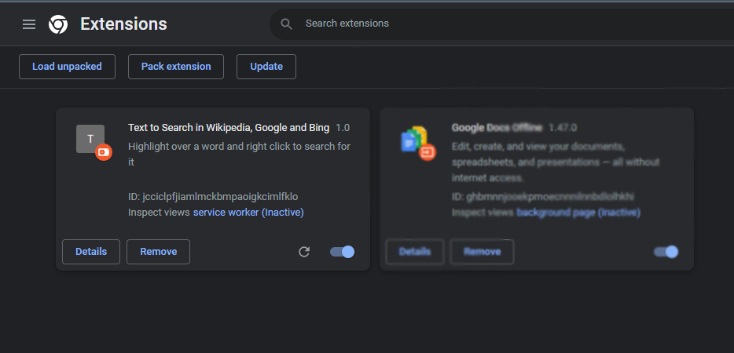
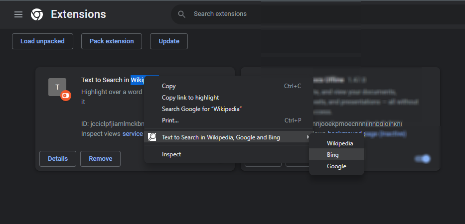

# Chrome_Extension

      <h1>
        Text To Search  
        Wikipedia, Google, Bing and YouTube
      </h1>
      

        You Have To HighLight Your Text and Right Click And Go With Your Choose
        Option
      

    

Clone repo-> <a href="https://github.com/VishalBhuse/Chrome_Extension.git">https://github.com/VishalBhuse/Chrome_Extension.git</a>

    

      

        <h2>Step 1:</h2>
        
Add Extension in your chrome Extension

        
      

      

        <h2>Step 2:</h2>
        
Highlight Tour Word and Right Click it

        
      

      

        <h2>Step 3:</h2>
        
After selecting menu with respect to than you are redirect to new tab.

        
      

    

